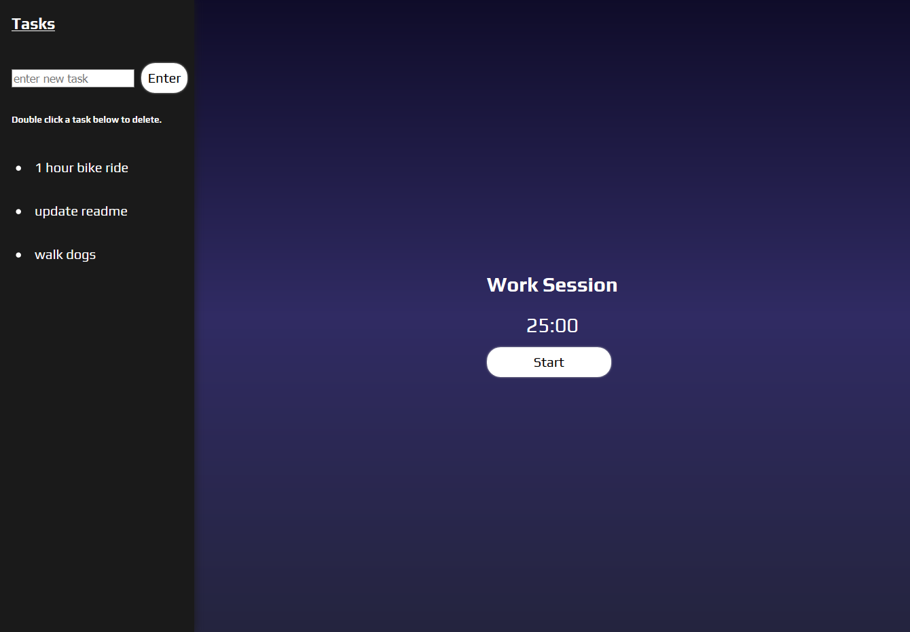

## Time-2-Work Pomodoro Timer

#### Time-2-Work is a timer and to-do list application that utilizes the Pomodoro method for work/break times. It's built using React and Firebase.

[Here is a link to the application](https://time2work.herokuapp.com).

### Technologies used

* React
* ES6
* Firebase
* Buzz Library

### Explanation

The Pomodoro Technique is a work/break timer methodology that typically utilizes a 25 minute work session, followed by a short break. In this application, the breaks are 5 minutes long.

Time-2-Work allows users to start the work timer and pause or reset if needed. Once the 25 minute work timer reaches 0:00, a ding is played, and the 5 minute break timer replaces the work timer. After the 4th work session, the user can take a 30 minute break.

### Problem

The first problem I had was figuring out how to make the "ding" happen.

### Solution

After messing around with a few different options, including creating my own oscillation, I decided to use the Buzz Library to play the ding. It is simple to use and allows easy playback of a sound as many times as needed.

### Problem

Another problem I ran into when creating the application was implementing a `createTask()` method that didn't reset the timer when adding a task. At first, every time I added a task, the entire application would reset, including the timer. This was the original code for the `Tasks.js` component:

    import React, { Component } from 'react';
    import './tasks.css';

    class Tasks extends Component {
      constructor(props) {
        super(props);
      this.state = { tasks: [], newTask: '', clickedTask: '' };
      this.tasksRef = this.props.firebase.database().ref('tasks');
      this.handleChange = this.handleChange.bind(this);
      this.createTask = this.createTask.bind(this);
      }

      componentDidMount() {
        this.tasksRef.on('child_added', snapshot => {
          const task = snapshot.val();
          task.key = snapshot.key;
          this.setState({ tasks: this.state.tasks.concat( task ) });
        });
      }

      handleChange(event) {
        event.preventDefault();
        this.setState({ newTask: event.target.value });
      }

      createTask(newTask) {
        this.setState({ task: newTask });
        this.tasksRef.push({ task: this.state.newTask, timeAdded: this.props.firebase.database.ServerValue.TIMESTAMP });
        this.setState({ newTask: '' });
      }

      render() {
        return(
          

            <h3>Completed Tasks</h3>
            <form className="task-form" onSubmit={() => this.createTask(this.state.newTask)}>
              <input type="text" value={this.state.newTask} placeholder="enter new task" onChange={this.handleChange}/>
              <button type="submit">Enter</button>
            </form>
            {this.state.tasks.sort((a, b) => b.timeAdded > a.timeAdded).map(task =>
              <ul className="task">
                <li key={task.key}>{task.task}</li>
              </ul>
            )}
          

        );
      }
    }

### Solution    

In order to fix the issue, I changed my `createTask()` method, as well as how it was called:    

    createTask(event) {
      event.preventDefault();
      this.tasksRef.push({ task: this.state.newTask, timeAdded: this.props.firebase.database.ServerValue.TIMESTAMP });
      this.setState({ newTask: '' });
    }

    <form className="task-form" onSubmit={this.createTask}>
      <input type="text" value={this.state.newTask} placeholder="enter new task" maxlength="50"onChange={this.handleChange}/>
      <button type="submit">Enter</button>
    </form>    

### Results/Conclusion

Overall, I am happy with how the application turned out. There are some styles that I would like to change in the future, but I am happy with the functionality of the application.
    
